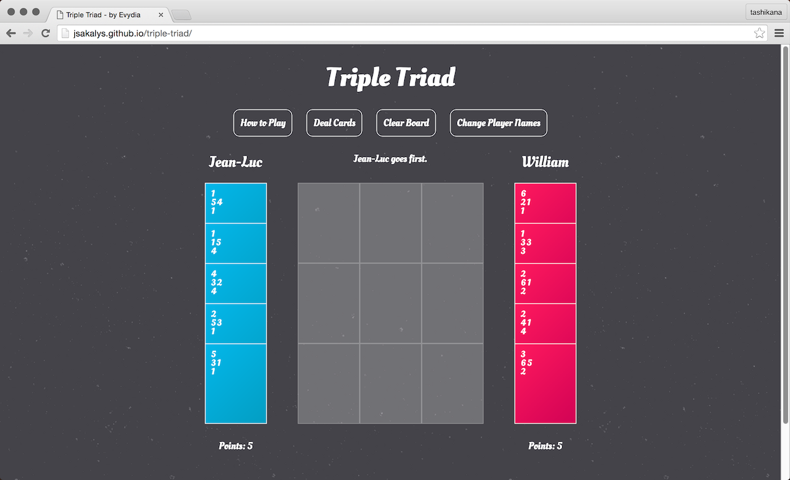
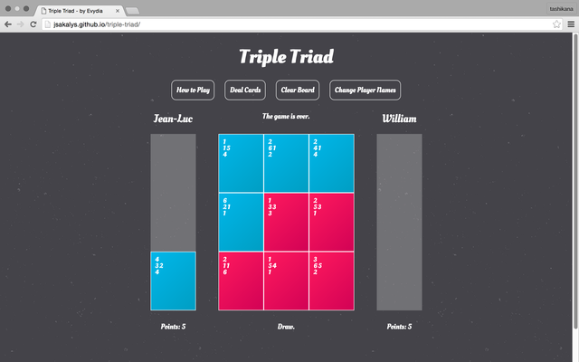

# Triple Triad

This is a browser-based mockup of the popular game Triple Triad, from the Final Fantasy video game series. It uses jQuery's draggable and droppable features, as well as grid snapping to achieve a quick and easy gameboard feel. The 11 cards in the deck are based off of the level 1 cards from Final Fantasy VIII. More cards will be added in the future.

### Screenshots

### Features
* Customizable player names
* Drag and drop cards
* Snap to grid functionality
* Scoreboard
* Fancy deal animation ;D

### Credits
* [jQuery](http://jquery.com)
* [jQuery UI](http://jqueryui.com)
* [jQuery Flip](http://nnattawat.github.io/flip/)
* [Subtle Patterns - Stardust](http://subtlepatterns.com/stardust)
* [Google Web Fonts - Oleo Script](http://google.com/fonts)
* [Sweet Alert](http://t4t5.github.io/sweetalert/)

### Known Issues
* Drag and drop is not yet functional on touch screen devices.

### Disclaimer
Final Fantasy and Triple Triad are the property of [Square Enix](http://square-enix.com).
